# TapOff

<p align="center">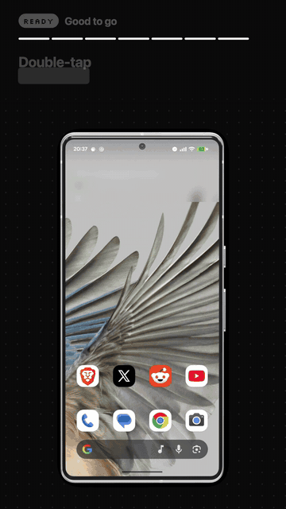</p>

Double-tap to turn your Android phone's screen off, for when the power button is worn out, hard to press
through a case, or just too far away. Double-tap the back of the phone for brightness and volume sliders. Plus
a wallpaper browser with wallpapers drawn around your camera hole.

**Download:** [TapOff.apk](https://github.com/taseen-t/tapoff/releases/latest/download/TapOff.apk) ·
**Website:** https://tapoff.vercel.app

<p align="center">
  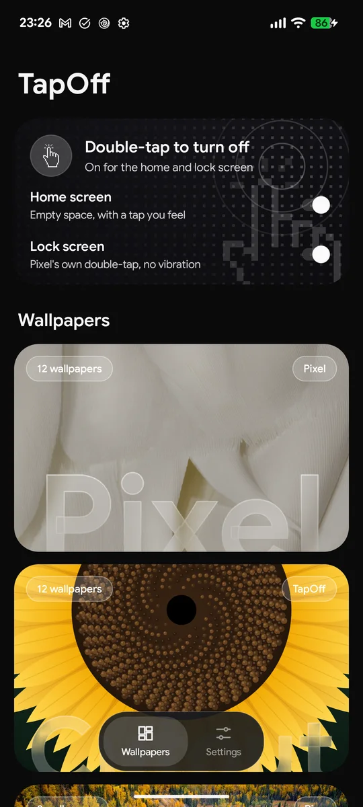
  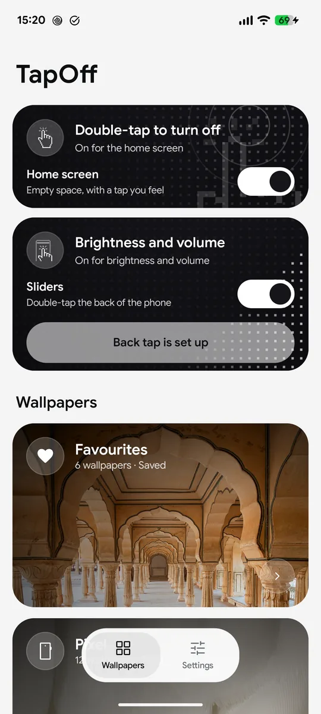
  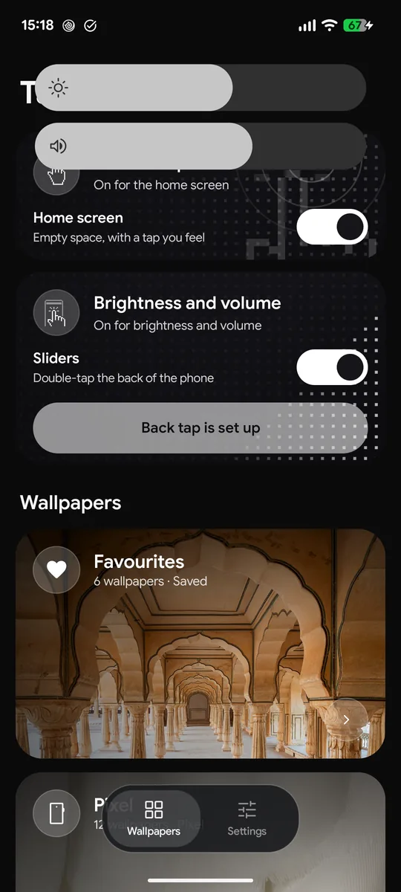
  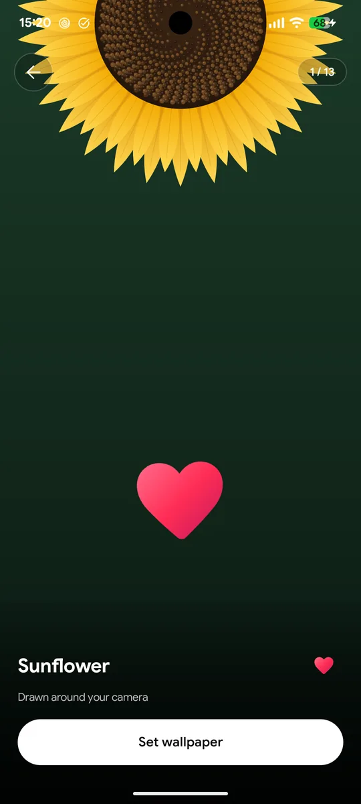
</p>

In most countries, opening that APK from a browser or file manager is blocked by Play Protect ("App blocked to protect
your device"), because TapOff has an accessibility service. [Install](#install) has the two ways in.

## What it does

- **Double-tap the home screen** on any empty space and the screen turns off, with a tap you feel.
- **Keeps bank apps working.** Many banking apps refuse to open while any accessibility service is on.
  TapOff's is off all the time and switches on for about a second only while it turns the screen off.
- **Fingerprint unlock still works** afterwards. The darkness closes in on the spot you tapped instead of flashing
  the lock screen.
- **Brightness and volume sliders** that grow out of the camera hole, in your wallpaper's colours. Open them by
  double-tapping the back of the phone (Pixel's Quick Tap → Open app → TapOff Sliders); in landscape they open in the
  middle of the screen. Drag to change; touch anything else and they tuck back in while the rest of the screen keeps
  working. Adaptive brightness stays on. Needs "Display over other apps".
- **Wallpapers:** Pixel's built-in ones, today's Bing photo, hand-checked art from Wallhaven, your own photo,
  and **Cutout**: 13 designs drawn live around your phone's camera hole (a black hole, a galaxy, a sunflower,
  a record, a keyhole...), and NASA's Hubble photos at full resolution. Whatever you pick goes on the home and lock
  screen. Double-tap one in the preview to save it to **Favourites**.

  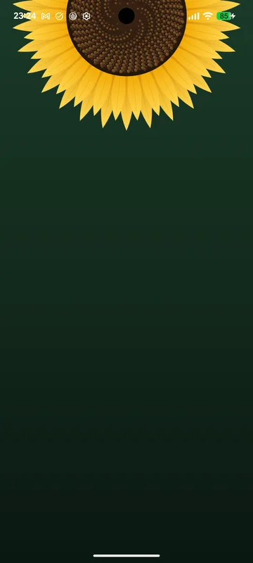 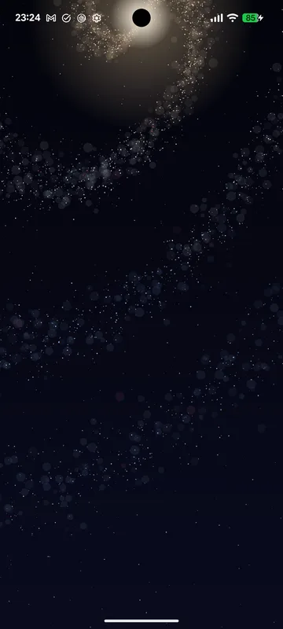
  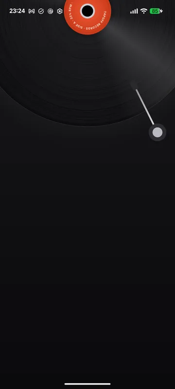 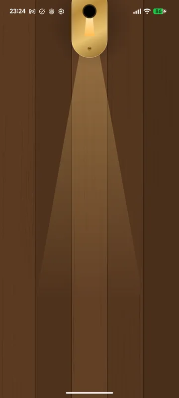
  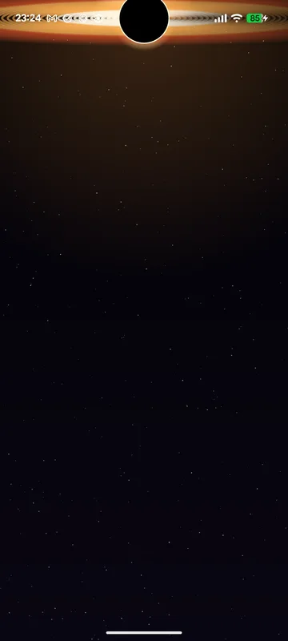 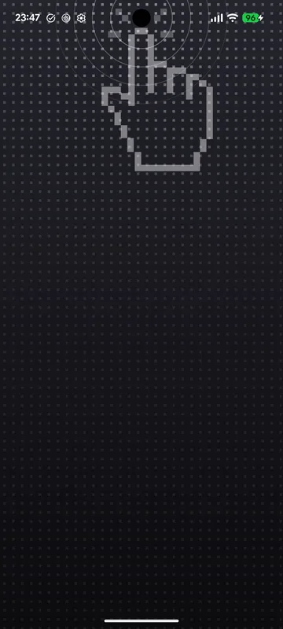

- **Quick Settings tiles** for Screen off and Volume.
- Light, dark or follow the system.
- Checks GitHub for a newer version and offers an update button.

## Install

TapOff needs Android 13 or newer. It was built and tested on a Pixel 7 running Android 17. It needs one permission
that apps can't give themselves, so setup is a one-time step, on the phone or from a computer.

### Without a computer (Shizuku)

<a href="https://tapoff.vercel.app/#setup">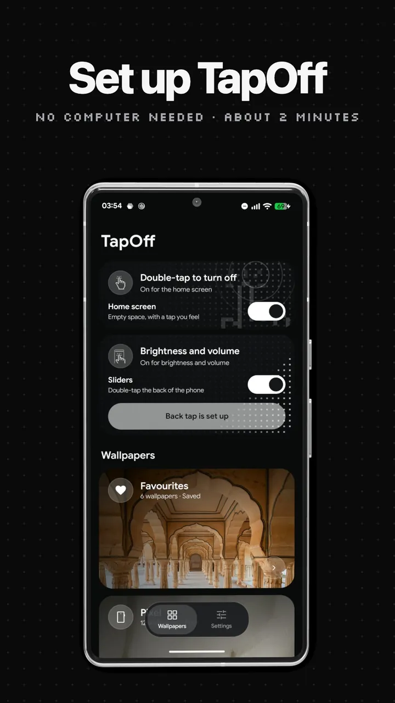</a>

Watch it first if you like: the [setup video](https://tapoff.vercel.app/#setup) (99 s) shows every step below on a
Pixel.

1. Download [TapOff.apk](https://github.com/taseen-t/tapoff/releases/latest/download/TapOff.apk) on the phone and
   install it. If Play Protect says "App blocked to protect your device": Play Store → your profile → **Play
   Protect** → the gear → turn off **Scan apps with Play Protect** → **Pause**, then install again. Scanning turns
   itself back on the next day.
2. Install [Shizuku](https://play.google.com/store/apps/details?id=moe.shizuku.privileged.api) from the Play Store,
   open it and start it with **Wireless debugging** (it walks you through pairing on the phone; needs Wi-Fi).
3. Open TapOff → Settings → **Set up without a computer** → **Allow**. The permission stays, so Shizuku can go
   afterwards.

Why Play Protect blocks it: Google's fraud protection (on in 185 markets) stops a browser or file manager from
installing any app with an accessibility service, and TapOff's accessibility service is what turns the screen off.
The block doesn't apply while app scanning is paused, or to installs run as *shell*. So instead of pausing, you can
start Shizuku first, install [InstallerX Revived](https://github.com/wxxsfxyzm/InstallerX-Revived/releases/latest)
(third-party, open source), set its **Authorizer** to **Shizuku** and open TapOff.apk with it: it installs as shell,
the same way a computer's `adb install` does. Keep Shizuku and you can install TapOff's updates that way too.

### With a computer

1. On the phone: Settings → About phone → tap **Build number** 7 times, then Settings → System → Developer options →
   turn on **USB debugging**.
2. On the computer: download [TapOff.apk](https://github.com/taseen-t/tapoff/releases/latest/download/TapOff.apk) and
   [Android platform-tools](https://developer.android.com/tools/releases/platform-tools), plug the phone in, accept the
   prompt on it, and run this in the folder with the APK:
   ```
   adb install -r TapOff.apk && adb shell pm grant com.taseen.tapoff android.permission.WRITE_SECURE_SETTINGS
   ```
   You can turn USB debugging off again afterwards; the permission stays.

### Then

1. Open TapOff and tap **Set TapOff as home wallpaper**. Choose **Home screen and lock screen**. The home-screen
   double-tap works through the wallpaper, so this step is required.
2. Optional: turn on **Sliders**, allow **Display over other apps**, then **Set up back tap** → Quick Tap → **Open app**
   → the gear → **TapOff Sliders**.

## Build from source

No Gradle. You need JDK 17 and the Android SDK (`platforms;android-35`, `build-tools;35.0.0`, which includes `aidl`).

```
./build.sh            # builds TapOff.apk
./build.sh --install  # also installs it on a connected phone and grants the permission
```

Set `JAVA_HOME` and `ANDROID_HOME` if they aren't the Homebrew defaults. The first build creates a signing key
(`debug.keystore`, never committed). Set `TAPOFF_KEYSTORE` / `TAPOFF_KEYSTORE_PASS` to use your own.

## How it works

| Part | File |
|---|---|
| Live wallpaper that hears home-screen taps (`android.wallpaper.tap`) and draws your wallpaper | `TapWallpaper.java` |
| Accessibility service that fades to black, locks, and switches itself off | `LockService.java` |
| Brightness and volume sliders from the camera hole | `NotchPanel.java` |
| What Quick Tap opens to show the sliders | `SlidersActivity.java` |
| Wallpaper sources, on-phone cache, applying to home and lock screen | `Wallpapers.java` |
| The Cutout designs, drawn around the real camera hole | `CutoutArt.java` |
| Main screen, deck of cards, settings | `MainActivity.java`, `GlassCard.java` |
| Full-screen preview with swipe, double-tap to favourite | `PreviewActivity.java`, `SwipeHint.java`, `DoubleTapHint.java` |
| Quick Settings tiles | `ScreenOffTile.java`, `VolumeTile.java` |
| Setup without a computer: receives Shizuku's binder and runs `pm grant` through it | `ShizukuSetup.java`, `src/moe/shizuku/` |

## Privacy

TapOff has no accounts, no analytics and no ads. It only goes online to fetch wallpapers (Bing, NASA, Wallhaven)
and to check GitHub for a newer version, and downloaded wallpapers are cached on the phone. The accessibility service reads nothing on
screen; it only turns the screen off.

## Credits

- Photos of the day from Bing; space photos from the [NASA Image and Video Library](https://images.nasa.gov); art
  from [Wallhaven](https://wallhaven.cc). Each belongs to its owner.
- Pixel wallpapers are read from the Pixel wallpaper app already on your phone; none are included here.
- The no-computer setup talks to [Shizuku](https://github.com/RikkaApps/Shizuku); its interface files in
  `src/moe/shizuku/` come from [Shizuku-API](https://github.com/RikkaApps/Shizuku-API) (Apache 2.0).
- App icons are [Material Symbols](https://fonts.google.com/icons) and the swipe hint's hand is Material Icons
  "touch_app" (Apache 2.0). Website icons are [Lucide](https://lucide.dev) (ISC).

## Bugs

Message [@taseen_tariq_](https://x.com/taseen_tariq_) on X. If you can't send a DM, reply to any post.

## License

[MIT](LICENSE)
